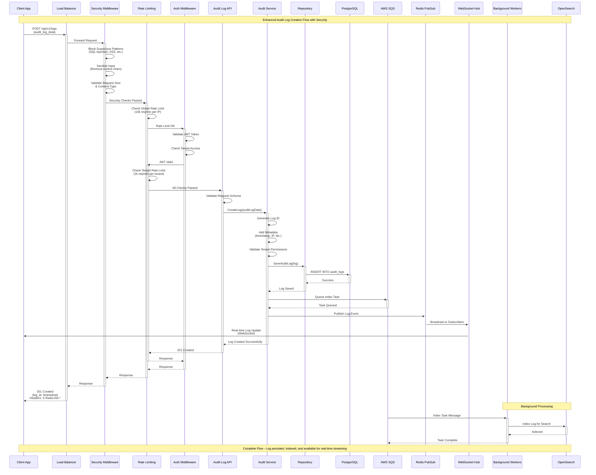
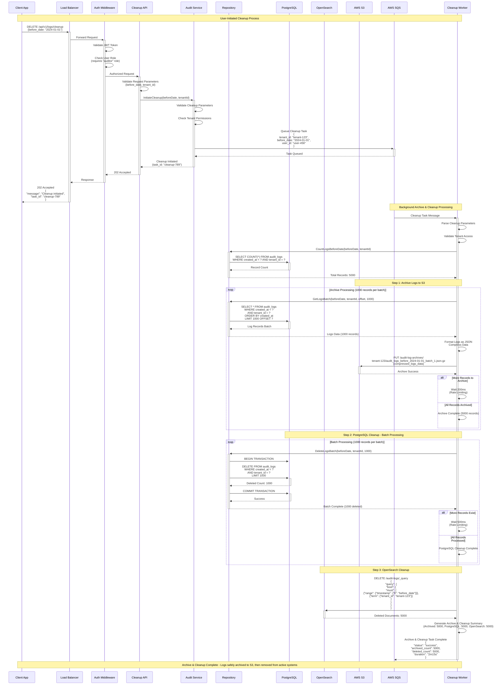

# System Architecture & Flow Diagrams

This document provides comprehensive visual representations of the enhanced audit log system's architecture, request flow, and data lifecycle management.

## Overview

The audit log system is designed to handle high-volume logging (1000+ req/s) with real-time processing, advanced search capabilities, comprehensive security, and automated data lifecycle management. The system has been enhanced with:

- **Multi-layer Security**: Rate limiting, input validation, suspicious pattern detection
- **Performance Optimization**: Benchmarking, load testing, smart caching
- **Enhanced Data Management**: Configurable retention policies, automated archival
- **Production-Ready Architecture**: Following golang-standards project layout

These diagrams illustrate the complete flow from API request to long-term storage with all security and performance enhancements.

---

## 1. System Architecture Overview

This diagram shows the complete system architecture and how all components interact with each other.

```mermaid
graph TB
    subgraph "Client Layer"
        Client[Client Application]
        Browser[Web Browser]
        Mobile[Mobile App]
    end
    
    subgraph "Security & Gateway Layer"
        LB[Load Balancer]
        SuspiciousBlock[Suspicious Pattern Detection]
        InputSanitize[Input Sanitization]
        RequestValidation[Request Size & Content-Type Validation]
        GlobalRateLimit[Global Rate Limiting]
        Auth[JWT Authentication]
        TenantRateLimit[Per-Tenant Rate Limiting]
        RoleCheck[Role-based Access Control]
    end
    
    subgraph "API Layer"
        AuditAPI[Audit Log API<br/>POST /api/v1/logs]
        BulkAPI[Bulk API<br/>POST /api/v1/logs/bulk]
        SearchAPI[Search API<br/>GET /api/v1/logs]
        ExportAPI[Export API<br/>GET /api/v1/logs/export<br/>(JSON/CSV)]
        StreamAPI[WebSocket Stream<br/>WS /api/v1/logs/stream]
        TenantAPI[Tenant Management<br/>POST/GET /api/v1/tenants]
    end
    
    subgraph "Service Layer"
        AuditService[Audit Log Service]
        TenantService[Tenant Service]
        ValidationSvc[Validation Service]
    end
    
    subgraph "Repository Layer"
        CompositeRepo[Composite Repository]
        PostgresRepo[PostgreSQL Repository]
        OpenSearchRepo[OpenSearch Repository]
    end
    
    subgraph "Message Queue"
        SQS[AWS SQS]
        IndexQueue[Index Queue]
    end
    
    subgraph "Background Workers"
        IndexWorker[Index Worker<br/>OpenSearch Indexing]
        ArchiveWorker[Archive Worker<br/>S3 Archival with Retention Policies]
        CleanupWorker[Cleanup Worker<br/>Data Lifecycle Management]
    end
    
    subgraph "Data Storage"
        PostgresW[(PostgreSQL Writer<br/>Primary Database + TimescaleDB)]
        PostgresR[(PostgreSQL Reader<br/>Read Replica)]
        OpenSearch[(OpenSearch<br/>Search & Analytics)]
        Redis[(Redis<br/>Rate Limiting + PubSub + Cache)]
        S3[(AWS S3<br/>Long-term Archive Storage)]
    end
    
    subgraph "Real-time Features"
        WebSocketHub[WebSocket Hub]
        PubSub[Redis PubSub]
        LiveStream[Live Log Stream]
    end
    
    %% Client Flow
    Client --> LB
    Browser --> LB
    Mobile --> LB
    
    %% Security & Authentication Flow
    LB --> SuspiciousBlock
    SuspiciousBlock --> InputSanitize
    InputSanitize --> RequestValidation
    RequestValidation --> GlobalRateLimit
    GlobalRateLimit --> Auth
    Auth --> TenantRateLimit
    TenantRateLimit --> RoleCheck
    
    %% API Routing
    RoleCheck --> AuditAPI
    RoleCheck --> BulkAPI
    RoleCheck --> SearchAPI
    RoleCheck --> ExportAPI
    RoleCheck --> StreamAPI
    RoleCheck --> TenantAPI
    
    %% Service Layer Flow
    AuditAPI --> AuditService
    BulkAPI --> AuditService
    SearchAPI --> AuditService
    ExportAPI --> AuditService
    StreamAPI --> WebSocketHub
    TenantAPI --> TenantService
    
    AuditService --> TenantService
    AuditService --> ValidationSvc
    
    %% Repository Flow
    AuditService --> CompositeRepo
    CompositeRepo --> PostgresRepo
    CompositeRepo --> OpenSearchRepo
    
    %% Database Writes
    PostgresRepo --> PostgresW
    PostgresRepo --> PostgresR
    OpenSearchRepo --> OpenSearch
    
    %% Queue Processing
    AuditService --> SQS
    SQS --> IndexQueue
    
    %% Worker Processing
    IndexQueue --> IndexWorker
    SQS --> ArchiveWorker
    SQS --> CleanupWorker
    
    IndexWorker --> OpenSearch
    ArchiveWorker --> S3
    CleanupWorker --> PostgresW
    
    %% Real-time Streaming
    AuditService --> PubSub
    PubSub --> WebSocketHub
    WebSocketHub --> LiveStream
    WebSocketHub --> Redis
    
    %% Styling
    classDef clientClass fill:#e1f5fe
    classDef apiClass fill:#f3e5f5
    classDef serviceClass fill:#e8f5e8
    classDef storageClass fill:#fff3e0
    classDef queueClass fill:#fce4ec
    classDef workerClass fill:#f1f8e9
    
    class Client,Browser,Mobile clientClass
    class AuditAPI,BulkAPI,SearchAPI,StreamAPI apiClass
    class AuditService,TenantService,ValidationSvc serviceClass
    class PostgresW,PostgresR,OpenSearch,Redis storageClass
    class SQS,IndexQueue queueClass
    class IndexWorker workerClass
```

### Architecture Components

- **Client Layer**: Various client applications (web, mobile, API clients)
- **Security & Gateway Layer**: Multi-layer security with pattern detection, input sanitization, rate limiting, authentication, and authorization
- **API Layer**: RESTful endpoints, WebSocket streaming, and export capabilities (JSON/CSV)
- **Service Layer**: Business logic, tenant management, and validation services
- **Repository Layer**: Data access abstraction with composite pattern
- **Message Queue**: Multi-queue SQS architecture for indexing, archival, and cleanup operations
- **Background Workers**: Specialized workers for OpenSearch indexing, S3 archival with retention policies, and data lifecycle management
- **Data Storage**: PostgreSQL with TimescaleDB, OpenSearch, Redis (rate limiting + PubSub), and AWS S3 for long-term archival
- **Real-time Features**: Live streaming and notifications with WebSocket support

---

## 2. Create Log Flow Sequence

This sequence diagram shows the step-by-step process when creating an audit log entry.



### Enhanced Flow Breakdown

1. **Multi-Layer Security**: Suspicious pattern detection, input sanitization, request validation
2. **Rate Limiting**: Global (per-IP) and per-tenant rate limiting with Redis backend
3. **Authentication & Authorization**: JWT validation and role-based access control
4. **Request Processing**: Schema validation and business logic processing
5. **Immediate Storage**: Write to PostgreSQL with TimescaleDB for immediate availability
6. **Async Processing**: Queue background tasks for indexing, archival, and cleanup
7. **Real-time Broadcasting**: Notify connected WebSocket clients with rate limit headers
8. **Background Workers**: Process queued tasks asynchronously with specialized workers

---

## 3. Cleanup Flow Sequence

This sequence diagram shows the cleanup process triggered by a user API request to remove old audit logs.



### Archive & Cleanup Process Breakdown

1. **API Request**: User makes DELETE request to `/api/v1/logs/cleanup` with date parameter
2. **Authentication**: Validates JWT token and checks for "auditor" role permission
3. **Validation**: Validates cleanup parameters and tenant permissions
4. **Task Queuing**: Queues archive & cleanup task in SQS for background processing
5. **Immediate Response**: Returns 202 Accepted with task ID for status tracking
6. **Archive Phase**: Worker archives logs to S3 in compressed JSON format
7. **Cleanup Phase**: Removes archived records from PostgreSQL and OpenSearch
8. **Status Tracking**: Task completion status with archive and deletion counts
