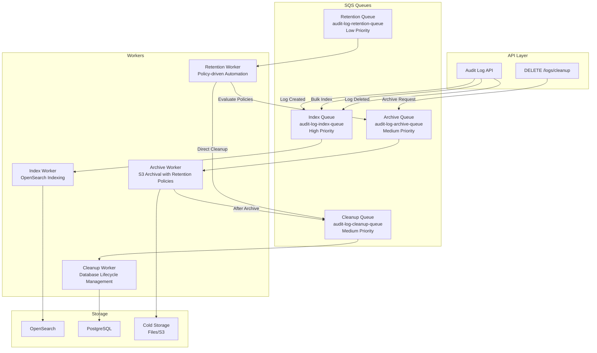

# Enhanced Queue Architecture & Background Processing

## Overview

The audit log API uses a **sophisticated multi-queue SQS architecture** with specialized workers for optimal performance, isolation, and monitoring. This design supports the enhanced retention policy system and ensures reliable background processing.

## Queue Types

1. **Index Queue** - Fast OpenSearch indexing operations
2. **Archive Queue** - S3 archival with retention policy support
3. **Cleanup Queue** - Database cleanup and lifecycle management
4. **Retention Queue** - Policy-driven data lifecycle automation

## Queue Configuration

### Environment Variables

```bash
# Index Queue (for log indexing to OpenSearch)
AWS_SQS_INDEX_QUEUE_URL=http://localhost:4566/000000000000/audit-log-index-queue

# Archive Queue (for log archival to S3 with retention policies)
AWS_SQS_ARCHIVE_QUEUE_URL=http://localhost:4566/000000000000/audit-log-archive-queue

# Cleanup Queue (for database cleanup and lifecycle management)
AWS_SQS_CLEANUP_QUEUE_URL=http://localhost:4566/000000000000/audit-log-cleanup-queue

# Retention Queue (for policy-driven data lifecycle automation)
AWS_SQS_RETENTION_QUEUE_URL=http://localhost:4566/000000000000/audit-log-retention-queue

# Legacy Queue (for backward compatibility)
AWS_SQS_QUEUE_URL=http://localhost:4566/000000000000/audit-log-queue
```

### Queue Attributes

| Queue | Visibility Timeout | Purpose | Message Retention | Priority |
|-------|-------------------|---------|-------------------|----------|
| Index | 30 seconds | Fast OpenSearch indexing | 24 hours | High |
| Archive | 60 seconds | S3 archival with retention policies | 24 hours | Medium |
| Cleanup | 60 seconds | Database cleanup and lifecycle | 24 hours | Medium |
| Retention | 120 seconds | Policy-driven data lifecycle | 48 hours | Low |

## Architecture Flow



## Enhanced Worker Operations

### 1. Index Worker (`cmd/index_worker/main.go`)
- **Queue**: `audit-log-index-queue`
- **Priority**: High (sub-second processing)
- **Operations**: 
  - Index new logs to OpenSearch for fast search
  - Bulk index operations for performance
  - Update/delete operations for data consistency
- **Message Types**: `INDEX`, `BULK_INDEX`, `UPDATE`, `DELETE`
- **Performance**: Optimized for 1000+ messages/second

### 2. Archive Worker (`cmd/archive_worker/main.go`)
- **Queue**: `audit-log-archive-queue`
- **Priority**: Medium
- **Operations**:
  - Read logs from PostgreSQL based on retention policies
  - Apply compression and metadata enrichment
  - Write logs to S3 with proper organization
  - Enqueue cleanup message after successful archival
- **Message Types**: `ARCHIVE_BY_POLICY`, `ARCHIVE_BY_DATE`, `BULK_ARCHIVE`
- **Features**: 
  - Retention policy-aware processing
  - Configurable compression (gzip, lz4)
  - Metadata tagging for compliance

### 3. Cleanup Worker (`cmd/cleanup_worker/main.go`)
- **Queue**: `audit-log-cleanup-queue`
- **Priority**: Medium
- **Operations**:
  - Delete logs from PostgreSQL after successful archival
  - Remove OpenSearch entries for deleted logs
  - Update retention job status
- **Message Types**: `CLEANUP_ARCHIVED`, `CLEANUP_BY_POLICY`, `CLEANUP_EXPIRED`
- **Safety**: Only processes verified archived data

### 4. Retention Worker (New - `cmd/retention_worker/main.go`)
- **Queue**: `audit-log-retention-queue`
- **Priority**: Low (scheduled processing)
- **Operations**:
  - Evaluate retention policies against current data
  - Generate archival and cleanup tasks
  - Update policy execution status
  - Send notifications for policy completion
- **Message Types**: `EVALUATE_POLICY`, `SCHEDULE_RETENTION`, `POLICY_NOTIFICATION`
- **Features**:
  - Cron-like scheduling for policy evaluation
  - Multi-tenant policy isolation
  - Policy conflict resolution

---

## Message Flow Patterns

### Real-time Log Processing
```
API Request → Index Queue → Index Worker → OpenSearch
                ↓
            Redis PubSub → WebSocket Clients
```

### Policy-driven Data Lifecycle
```
Retention Worker → Evaluate Policies → Archive Queue → Archive Worker → S3
                                          ↓
                                    Cleanup Queue → Cleanup Worker → PostgreSQL
```

### Manual Cleanup Request
```
DELETE /logs/cleanup → Archive Queue → Archive Worker → Cleanup Queue → Cleanup Worker
```

---

## Performance & Monitoring

### Queue Metrics
- **Message throughput**: Index (1000+ msg/s), Archive/Cleanup (100 msg/s)
- **Processing latency**: Index (<1s), Archive (5-30s), Cleanup (1-5s)
- **Dead letter queues**: Automatic retry with exponential backoff
- **Monitoring**: CloudWatch metrics for queue depth, processing time

### Worker Scaling
- **Auto-scaling**: Based on queue depth and processing time
- **Resource allocation**: CPU/memory optimized per worker type
- **Fault tolerance**: Graceful shutdown, message acknowledgment patterns

### Error Handling
- **Retry policies**: Exponential backoff with jitter
- **Dead letter queues**: Failed messages for manual intervention
- **Alerting**: Slack/email notifications for critical failures
- **Logging**: Structured logging with correlation IDs
